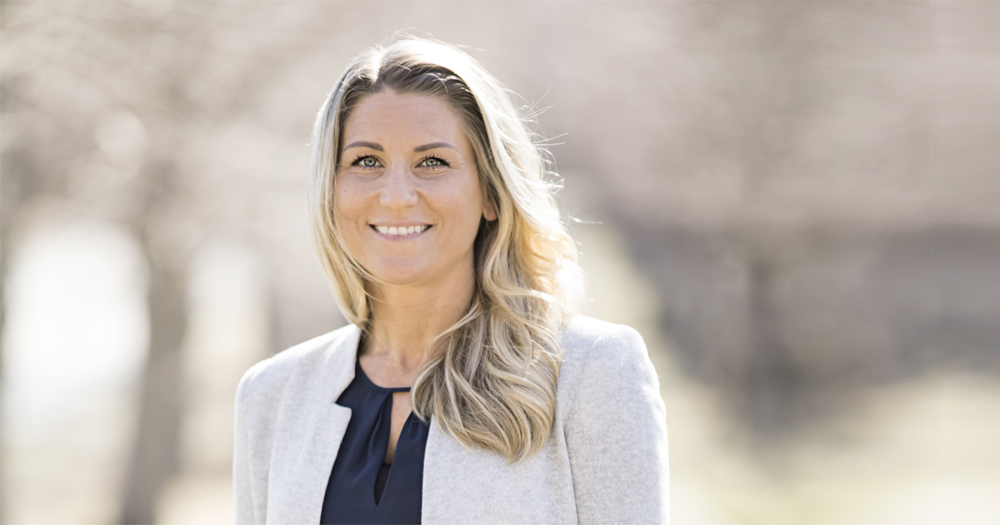

## Vad är Dataprata?

Den nya gratistjänsten Dataprata är ett initiativ från [Gibon](https://www.gibon.se) och [Daresay](https://daresay.co)
för att hjälpa äldre och andra datorovana personer att ha kontakt med sina anhöriga trots social isolering.

Dataprata gör det enklare att kommunicera med video, ljud och bild. Sajten känner av vilken enhet användaren har, ger tydliga steg-för-steg-instruktioner
för att komma igång och hjälper till att starta upp de vanligaste apparna för videoträffar. Sajten är enkelt uppbyggd och har extra tydliga knappar och text.

> Mia på Gibon är en av initiativtagarna till dataprata

## Varför har ni tagit detta initiativ?

&ndash; Vi vill bidra med det vi kan när samhället drabbats så hårt av covid-19. Gibon kan digitala lösningar och Daresay kan allt om digitala upplevelser - vi insåg att vår kompetens kan göra nytta genom att erbjuda framförallt den äldre generationen en förenklad möjlighet att kommunicera med sina nära och kära via videosamtal, säger Mia Åslander, vd på Gibon som är initiativtagare till Dataprata.

Vad den äldre generationen tydligt uttrycker är att man saknar tydliga instruktioner, på sitt modersmål, för att börja nyttja tjänsterna. Det tog vi fasta på. Målet är att översätta sajten till fler språk så att även personer med annat modersmål än svenska ska kunna nyttja tjänsten. Här behöver vi dock hjälp av andra, så den som har kunskap får gärna bidra för att flera grupper av människor ska kunna kommunicera digitalt.

## Vad önskar ni uppnå?

Vi önskar göra det lättare för äldre och andra datorovana att kommunicera över nätet. Tjänsten Dataprata gör det enklare att kommunicera med video, ljud och bild.

## Vilka riktar ni er till med ert initiativ?

Våra isolerade riskgrupper, framförallt den äldre generationen med låg datorovana, men även andra isolerade grupper i samhället som vill vara nära sina kära.

Dock är dessa grupper svåra att nå digitalt så därför riktar vi vårt budskap till barn och barnbarn med uppmaningen att videoprata med en anhörig redan ikväll med hjälp av vår tjänst.

## För mer information kontakta:

Mia Åslander, vd Gibon  
[076-188 91 77](tel:+46761889177) 
[mia.aslander@gibon.se](mailto:mia.aslander@gibon.se)</a>

## Om Gibon

Gibon erbjuder digitala lösningar för små och medelstora företag runt om i Sverige. Gibon har 140 medarbetare på 13 orter och företaget har en omsättning på drygt 350 miljoner.

## Om Daresay

Daresay är en digitalbyrå som skapar prisbelönta användarupplevelser. I samarbete med våra kunder levererar vi resultat som står ut från mängden och rustar företag och organisationer för en framtid i konstant förändring.
